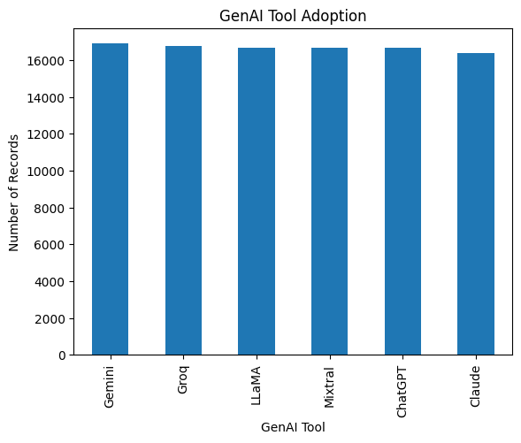
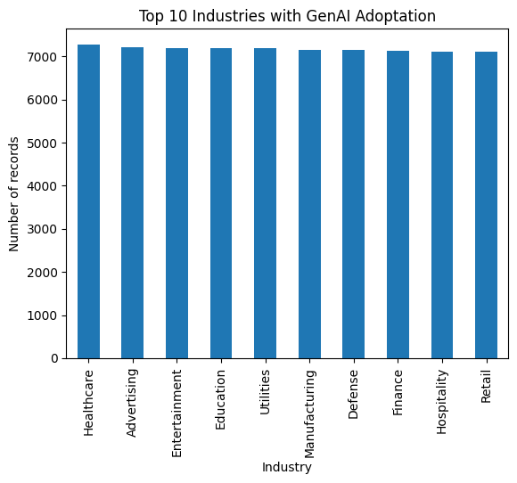

# Enterprise GenAI Adoption Analysis

### Python · Pandas · NumPy · Matplotlib · Seaborn · SciPy

> **An exploratory data analysis of 100,000 enterprise GenAI records to understand adoption, productivity, training, and industry patterns.**

---

## Project Overview

This project analyzes enterprise GenAI adoption across **14 industries, 6 GenAI tools, and 2022–2024**.

The analysis follows a simple progression:

```text
Business Questions
        ↓
Data Cleaning & Exploration
        ↓
Descriptive Analysis
        ↓
Productivity & Training Analysis
        ↓
Statistical Testing
        ↓
Business Findings
```

### Questions Explored

* Which GenAI tools are being adopted?
* How does adoption vary across industries and time?
* Do productivity outcomes differ between tools?
* Is employee training associated with productivity?
* Is GenAI tool usage associated with industry?

---

## What's Inside

| File                              | Description                             |
| --------------------------------- | --------------------------------------- |
| `Enterprise_GenAI_Analysis.ipynb` | Complete analysis and statistical tests |
| `data/`                           | Dataset used for the analysis           |
| `visuals/`                        | Key charts from the analysis            |
| `requirements.txt`                | Python dependencies                     |

---

## Key Findings

**[01 · Productivity outcomes vary across GenAI tools](#productivity-by-genai-tool)**

**[02 · Training is associated with reported productivity](#training-vs-productivity)**

**[03 · Industry and tool usage show no statistically significant association](#industry--genai-tool-usage)**

**[04 · Adoption is distributed across tools and industries](#genai-tool-adoption)**

---

# Analysis

## GenAI Tool Adoption

The dataset contains six GenAI tools with broadly similar representation.



## Adoption Across Industries

Records are distributed across 14 industries, enabling industry-level comparisons.



## Adoption Over Time

The dataset covers adoption records from 2022–2024.


## Productivity by GenAI Tool

Average reported productivity change differs across GenAI tools.


**Business relevance:** Provides a basis for comparing reported productivity outcomes across tools.

## Training vs Productivity

Training hours were compared with reported productivity change using correlation analysis.


**Correlation:** `[INSERT VALUE]`

**Business relevance:** Examines whether organizations providing more training also report different productivity outcomes.

## Industry × GenAI Tool Usage


A chi-square test found **no statistically significant association** between industry and GenAI tool usage (`p > 0.05`).

---

## Dataset

**100,000 records · 14 industries · 6 GenAI tools · 2022–2024**

Key variables include:

`Company · Industry · Country · GenAI Tool · Adoption Year · Employees Impacted · Training Hours · Productivity Change · Employee Sentiment`

---

## Limitations

This is an observational analysis. Results show **patterns and associations, not causal effects**.
